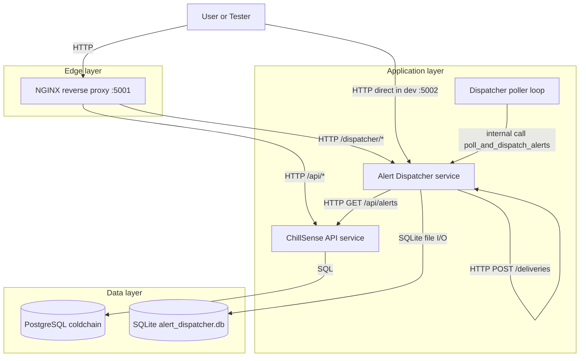
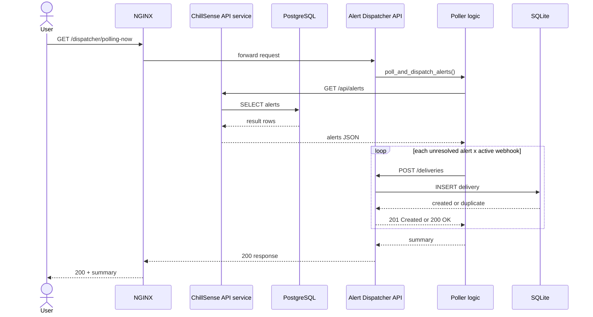

# Alert Dispatcher Service (Auxiliary)

Alert Dispatcher is a separate auxiliary service for ChillSense.
Its job is to read unresolved alerts from the main API and create delivery logs for webhook notifications.

Main project guide: [README.md](README.md)

## 1. Required justification: why this auxiliary service exists

### 1.1. What this service does (approximation accepted by course requirement)

- It polls unresolved alerts from ChillSense API.
- It processes notification dispatch flow per active webhook.
- It records delivery attempts as operational logs.
- In this project stage, webhook sending is intentionally mocked (`FAKE SEND`).
- This is still valid because the required part is the interaction and service separation.

### 1.2. Why this service is necessary

- Polling and dispatch are ongoing operational tasks, not normal CRUD endpoints.
- Keeping this logic outside the main API helps shipments/readings endpoints stay focused and responsive.
- Dispatcher can be started, restarted, and monitored independently from ChillSense API.
- Webhook configuration and delivery audit logs are cleaner when stored in a dedicated service boundary.

### 1.3. Why implementing directly in ChillSense API is problematic

- Delivery depends on external networks and can be slow, unstable, or temporarily down.
- If delivery logic runs directly in API request paths, user-facing requests can become slower and less reliable.
- Retry/polling behavior can keep API worker processes busy with background concerns.
- Error isolation is weaker: failures in notification flow can affect API runtime behavior.

## 2. Overview in the ecosystem (clear relation to other components)

This is the role of each component:

- ChillSense API (`src/`): source of business data (shipments, readings, alerts).
- Alert Dispatcher (`services/alert_dispatcher/`): background-style worker + API for webhook and delivery logs.
- PostgreSQL: main data for ChillSense API.
- SQLite (`services/alert_dispatcher/alert_dispatcher.db`): local operational data for dispatcher (webhooks and deliveries).
- NGINX (production-like mode): public entry point that routes traffic to both services.

In short:

- ChillSense API is responsible for creating alerts.
- Alert Dispatcher is responsible for consuming unresolved alerts and recording notification delivery attempts.

## 3. How the interaction works (end-to-end)

1. A new reading is posted to ChillSense API.
2. If temperature is out of range, ChillSense API creates an alert.
3. Alert Dispatcher poller calls `GET /api/alerts` on ChillSense API.
4. It filters unresolved alerts (`is_resolved=false`).
5. For each active webhook, it records one delivery attempt via `POST /deliveries`.
6. Delivery history is visible at `GET /deliveries`.

Current implementation note:

- `send_webhook()` is intentionally mocked (`FAKE SEND`) at this stage.
- This is acceptable for the course goal because the required part is the service interaction and separation of responsibilities.

## 4. Service responsibilities

- Manage webhooks (`GET /webhooks`, `PUT /webhooks/<id>`).
- Store delivery records (`GET /deliveries`, `POST /deliveries`).
- Poll unresolved alerts from ChillSense API and create delivery attempts.
- Provide demo/manual trigger endpoint (`GET /polling-now`).

## 5. Architecture diagrams (services, protocols, interaction)

The diagrams below show how services are connected and which communication protocol is used.

### 5.1. Component diagram

### 5.2. Sequence diagram

Deployment notes:

- In production-like mode, public traffic enters through NGINX.
- In development mode, alert-dispatcher can also be called directly on port `5002`.

## 6. Operational guide

This operational guide is mandatory documentation for this auxiliary service.

- Run/setup/test/demo instructions: [ALERT_DISPATCHER_OPERATIONS.md](ALERT_DISPATCHER_OPERATIONS.md)

## 7. Documentation format used for public API/functions

To satisfy the "method documentation" requirement in a service-oriented project, this auxiliary service documents public HTTP methods using OpenAPI/Swagger and documents internal callable functions with Python docstrings.

- OpenAPI source: `services/alert_dispatcher/openapi.yaml`
- Swagger UI source loading: configured in `services/alert_dispatcher/__init__.py` and exposed at `/apidocs/` when debug mode is enabled.
- HTTP resources implementation: `services/alert_dispatcher/resources/`

What is documented in OpenAPI for each public endpoint:

- Short description/purpose (`summary` + `description`).
- Input parameters (`path` params and `requestBody` schema, including allowed values).
- Output (`200/201` response schema and payload shape).
- Exception/error behavior (`400/404/409/415/502` response cases).

Internal public function documentation locations:

- Poll-and-dispatch flow: `services/alert_dispatcher/poller/dispatcher.py`
- ChillSense API fetcher: `services/alert_dispatcher/poller/chillsense_client.py`
- Polling runtime loop: `services/alert_dispatcher/poller/runtime.py`

Note for reviewers:

- API-level documentation is normative in `openapi.yaml`.
- Function-level code documentation is intentionally concise in docstrings, while detailed API I/O/error contracts are maintained in OpenAPI.
