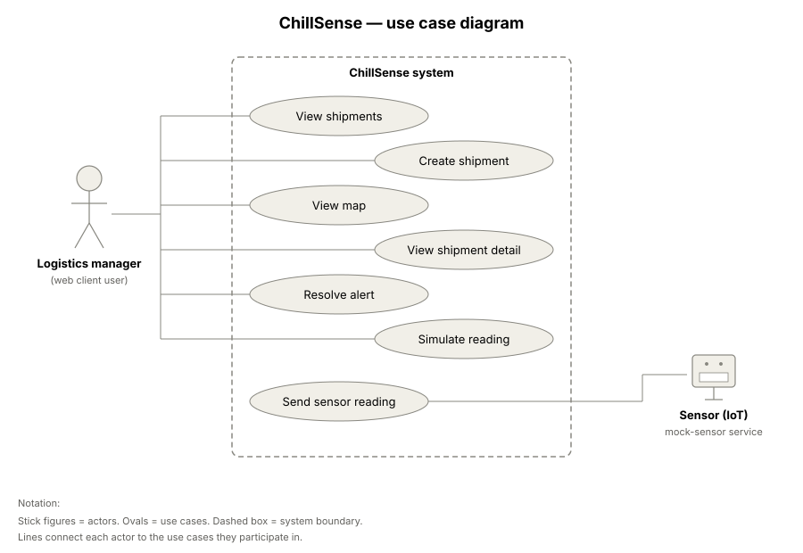
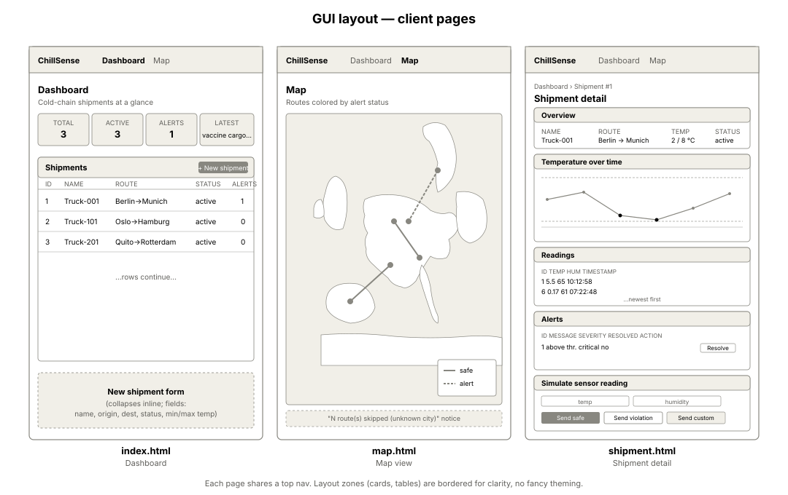
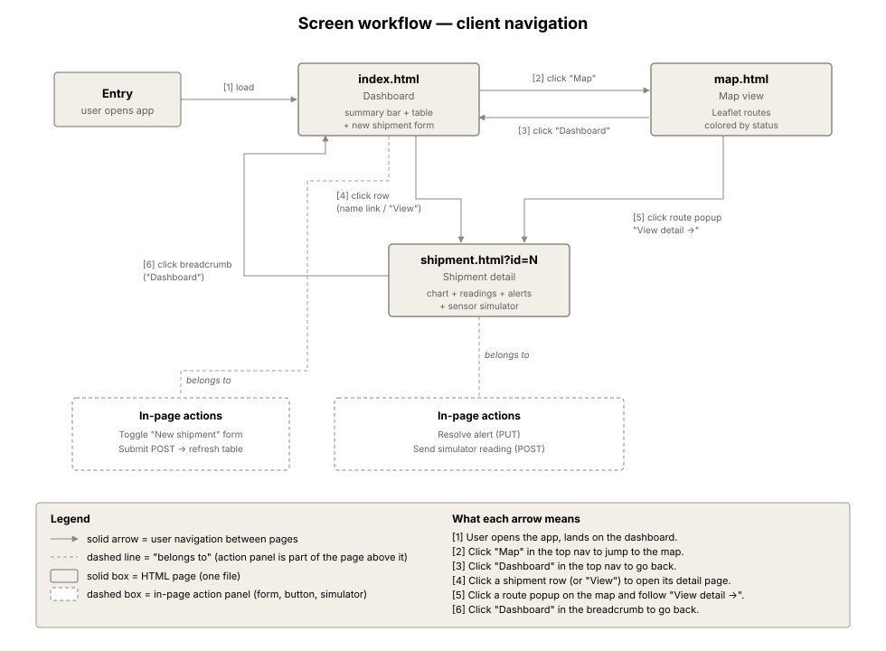
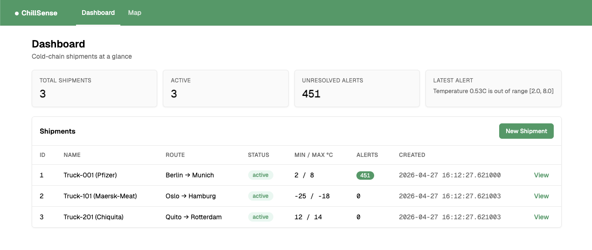
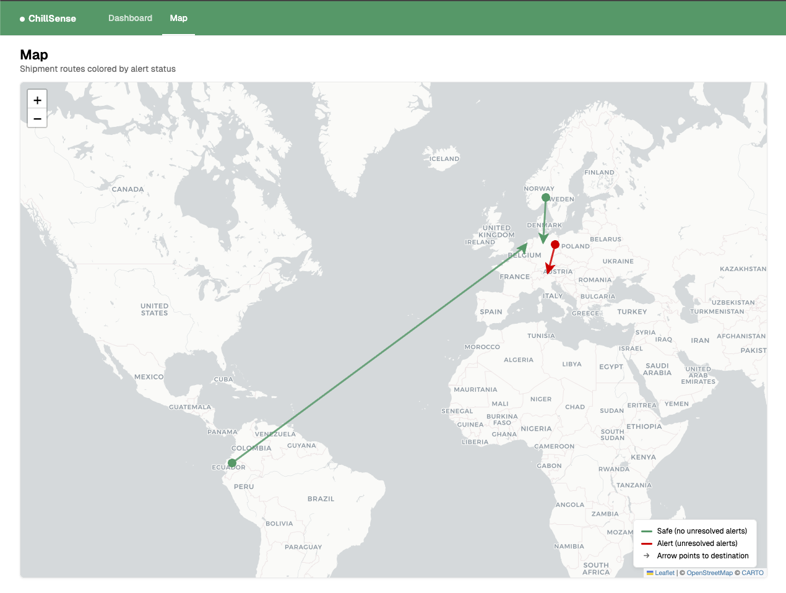
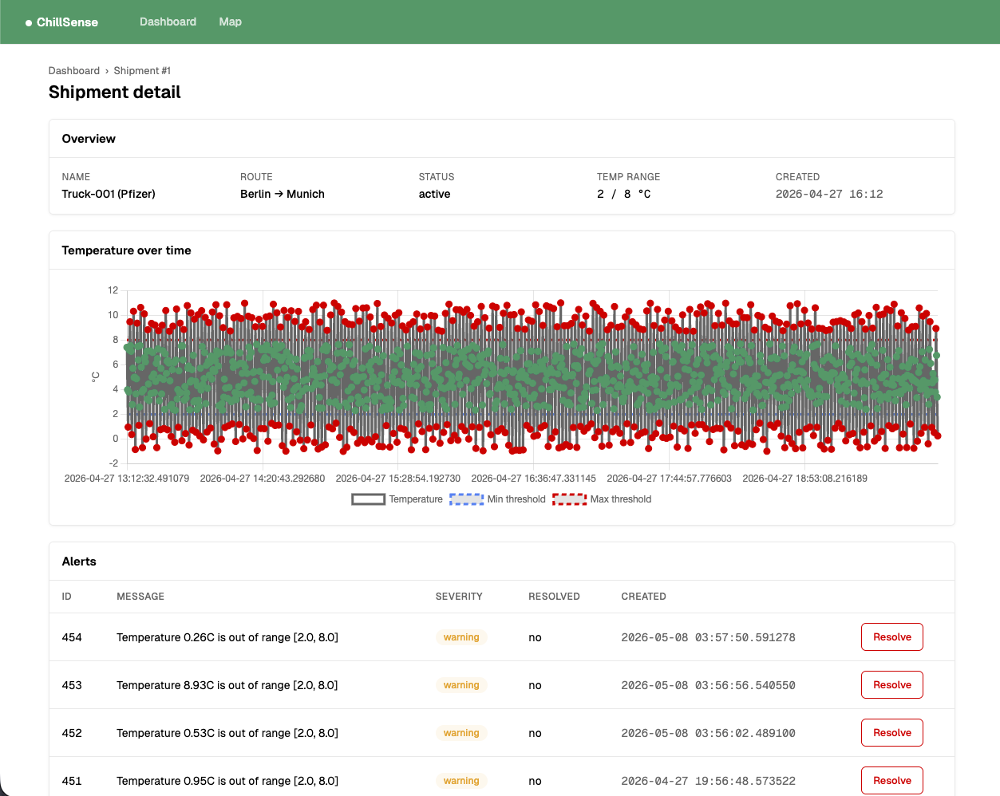
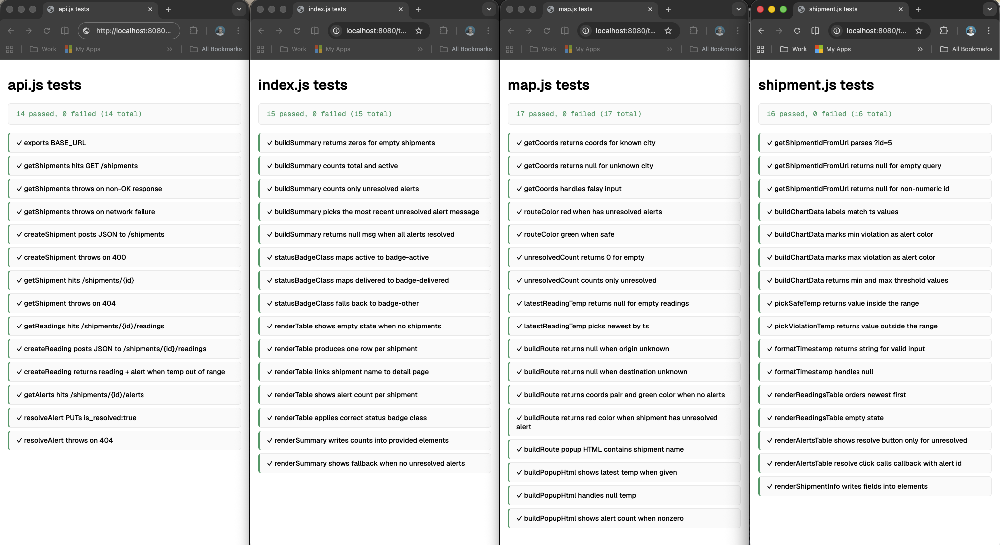

# ChillSense Client Dashboard

A static web client for the ChillSense REST API. It gives logistics
managers a dashboard for cold-chain shipments, a map view and a shipment detail page with a temperature
chart, readings/alerts tables, and a sensor simulator. No build step, no
framework, no `npm install`. Open it in a browser.

This README covers the client only. For full API setup (Postgres, the
Flask app, NGINX, the seed script), see the [project root README](../README.md).

## Pages

| File            | What it does                                                                                                                                                                                                                    |
| --------------- | ------------------------------------------------------------------------------------------------------------------------------------------------------------------------------------------------------------------------------- |
| `index.html`    | Dashboard. Summary bar (total / active / unresolved alerts / latest alert message) and a shipments table. New shipment form is collapsible at the top.                                                                          |
| `map.html`      | Leaflet map showing each shipment as a polyline between origin and destination. Routes are green if safe, red if there's an unresolved alert. Click a line for a popup with status, latest temp, and a link to the detail page. |
| `shipment.html` | Per-shipment detail. Overview card, Chart.js temperature chart with min/max threshold lines, readings table, alerts table with a Resolve button, and a sensor simulator that posts safe / violation readings to the API.        |
| `api.js`        | Shared module. One fetch helper per endpoint, plus the API base URL constant. All three pages import from here.                                                                                                                 |
| `tests/`        | Browser test pages (one per JS module). 63 tests total, run by opening the HTML files in any browser.                                                                                                                           |

## Project structure

```
client/
├── api.js
├── index.html
├── index.js
├── map.html
├── map.js
├── shipment.html
├── shipment.js
├── diagrams/
│   ├── use_case.svg
│   ├── gui_layout.svg
│   └── screen_workflow.svg
└── tests/
    ├── test_api.html       (14 tests)
    ├── test_index.html     (15 tests)
    ├── test_map.html       (17 tests)
    └── test_shipment.html  (17 tests)
```

## Diagrams

Three diagrams describe the client at different levels: who uses it, what
the screens look like, and how the user moves between them. Source files
are in `diagrams/` so they can be edited or re-exported later.

### Use case diagram

Actors and the use cases each one participates in. Logistics manager
covers the web client interactions; the mock sensor service feeds
readings into the system.



### GUI layout

Wireframe of all three pages side by side, showing the main UI zones
(top nav, summary cards, tables, chart, simulator). Not pixel-perfect,
just enough to communicate the intended structure.



### Screen workflow

How the user navigates between the three pages, and what in-page actions
each page supports. Solid arrows are navigation, dashed lines mean the
action panel is part of the page above it.



## Screenshots

Real screenshots of the three pages, taken in our local host implementation, are provided below. The UI is identical on the Cloud VM deployment.

### Dashboard



### Map



### Shipment details



## How to run

You need the ChillSense API running first. From the project root:

```bash
docker compose up
```

The API will be at `http://localhost:5001/api`. For the full API setup
(Postgres details, NGINX, troubleshooting, environment variables), see
the [project root README](../README.md).

Then serve the client. From inside `client/`:

```bash
python -m http.server 8080
```

Open `http://localhost:8080/index.html` in any browser.

You can also open the HTML files directly from the filesystem (`file://...`)
but ES module imports are flaky over `file://` in some browsers, so the
local web server is the recommended way.

## Configuring the API URL

The client points at `http://localhost:5001/api` by default. To use a
different backend (the production VM, a tunnel, etc.), edit one line:

```js
// client/api.js, line 7
export const BASE_URL = 'http://localhost:5001/api';
```

For the Cloud VM deployment, change it to:

```js
export const BASE_URL = 'http://34.88.97.198:5001/api';
```

That's the only place the URL appears, every page imports from here.

## Running tests

The test suite lives in `tests/` and runs in the browser. Start the local server (if it isn't already running from the "How to run" step):

```bash
cd client
python -m http.server 8080
```

Then open these URLs in any browser:

```
http://localhost:8080/tests/test_api.html       (14 tests)
http://localhost:8080/tests/test_index.html     (15 tests)
http://localhost:8080/tests/test_map.html       (17 tests)
http://localhost:8080/tests/test_shipment.html  (17 tests)
```

Each page shows a green / red summary at the top and a list of every test.
The tests stub `window.fetch` (or pass fake data straight into render
functions) so they don't touch the network and don't need the API to be
running. They cover:

- URL construction and HTTP method for every API call
- Error handling on non-OK responses and network failures
- Data shaping for the chart and the summary bar
- Render output for tables, badges, popups, and the alert-count pill
- City lookup, route coloring, popup HTML for the map

If a test fails, the row turns red and shows the assertion error
inline so you can see what went wrong without opening the console.



## Libraries

All loaded from CDN, no package manager needed.

| Library                | Version | Used in         | License                              |
| ---------------------- | ------- | --------------- | ------------------------------------ |
| Leaflet                | 1.9.4   | `map.html`      | BSD-2                                |
| Chart.js               | latest  | `shipment.html` | MIT                                  |
| Geist                  | latest  | all pages       | OFL 1.1                              |
| CartoDB Positron tiles | n/a     | `map.html`      | CC BY 3.0 (attribution shown on map) |

## Known limitations

- The `New Shipment` form on the dashboard waits 200ms after a successful
  POST before reloading, because the API caches `GET /shipments` and the
  cache occasionally serves stale data.
- The map only knows about the cities listed in `CITY_COORDS` in
  `map.js`. Shipments with origins or destinations outside that list are
  silently skipped (with a small notice above the map listing what was
  skipped). Add new cities to that object as needed.
- The sensor simulator on the detail page reuses the value in the
  Humidity input across "safe" and "violation" sends. Leave it blank to
  let the API record `null`.

## Sources and AI usage

Anthropic's Claude (Opus 4.7,via claude.ai, April 2026) was used as a coding assistant for parts of the
work: it helped with refactoring suggestions, the structure of the test
harness, and the SVG generation for the three diagrams in `diagrams/`
(use case, GUI layout, screen workflow). Diagrams were iterated on with
Claude for the graphics and the layout, then reviewed and adjusted by hand
until the overlapping lines, label placement, and overall composition
looked right.
